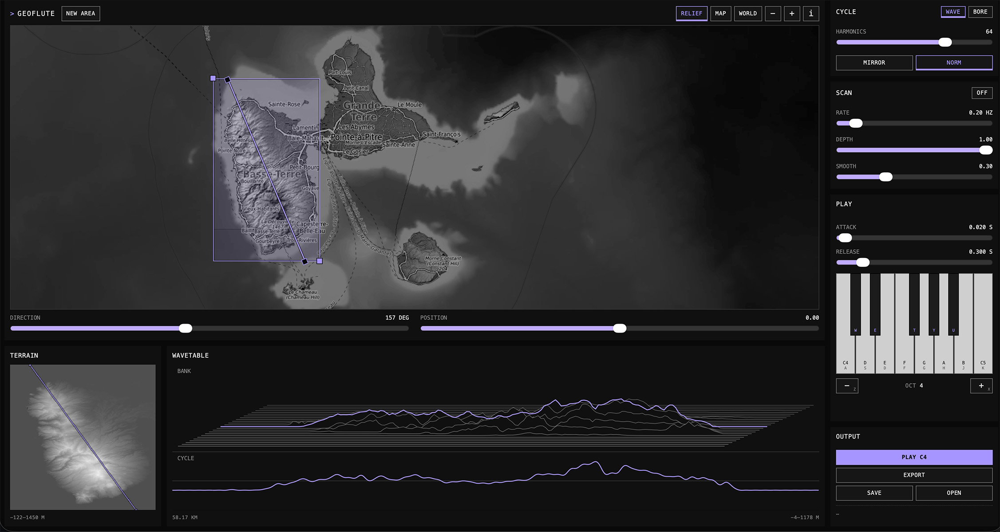

# GeoFlute: Play the shape of the land

GeoFlute turns map terrain into a playable oscillator. A directed line across a
selected area carries an elevation profile, and that profile becomes a cycle you
play from the screen or the computer keyboard. The result can be played in the
browser, saved as an editable session, or exported as wavetable banks and
sampled instruments for other applications.

See it live: [**https://janne-s.github.io/GeoFlute/**](https://janne-s.github.io/GeoFlute/)

## How it works

Select an area on the map, then set the direction the transect runs across it
and where it sits. The relief along that line becomes the sound: geometry
determines the timbre and the note you play determines the pitch. The mapping is
musical and experimental.

The area is a bank of parallel transects rather than one fixed profile.
**POSITION** moves through the stack by hand and **SCAN** sweeps it
automatically, so a held note keeps moving as the relief under it changes.
Nothing stops while you work: changing the area, the cycle or the scan retunes
what is sounding instead of cutting it.

Two voices read the same relief. **WAVE** reads it as a waveform and plays it as
a band-limited oscillator cycle. **BORE** reads it as a tube, taking the
elevation curve as the bore's cross-section, so the terrain acts as the
resonating body rather than the sample.

**EXPORT** opens a package. The WAVE voice writes two wavetable banks, one in
each of the two cycle lengths in common use, with an optional single cycle
beside them. The BORE voice writes a multisampled instrument and its key map, in stereo
whenever WIDTH is above MONO.
Either voice can add the metadata document and the transect relief. Each item
names the hosts it suits and its size before anything is rendered. One
selection downloads on its own, several arrive as a ZIP.

Turn **NORM** off before exporting if you want the terrain's own relief in the
file. Hosts that level every frame on import remove exactly that relief, so
disable that behaviour where it is offered — in Ableton, for example, the
relief survives only with `Raw` enabled.

The area, map view and every setting are kept in the browser and restored the
next time the page opens. **SAVE** and **OPEN** are for moving a session
somewhere else: to another browser or machine, to a colleague, or into more than
one file. The saved file and the metadata document from an export package are
the same document, so **OPEN** accepts either.

## Controls

- **NEW AREA** — Arms a single gesture for drawing a new area. An existing area
  is moved by dragging it and reshaped from its corner handles.
- **Search** — The magnifier at the foot of the map takes a place name, a
  coordinate pair, or a pasted map link, and moves the selected area there.
- **RELIEF / MAP** — Switches the base layer between shaded relief and the
  street map.
- **WORLD** — Returns the view to the whole world.
- **i** — Opens the area bounds, DEM source and resolution, seed, and
  attribution details.
- **DIRECTION** — Sets the compass bearing the transect runs along, which is
  what makes an anisotropic landscape sound different in each direction.
- **POSITION** — Moves the transect across the area, from one edge to the other.
- **WAVE / BORE** — Chooses the voice, and with it the cycle settings and the
  export items.
- **HARMONICS** — Limits how many partials the cycle keeps, from a single
  rounded shape to the full detail of the relief.
- **MIRROR** — Folds the profile into a symmetric cycle instead of playing the
  transect once as it is.
- **NORM** — Levels every frame to a consistent working level. With it off,
  amplitude follows the actual relief and a low hill stays quieter than a
  mountain.
- **DEPTH** — Scales how strongly the relief shapes the bore's cross-section.
- **DECAY** — Sets how long the bore rings.
- **TONE** — Sets how much the bore's wall absorbs the upper partials.
- **BLOW** — Sets the strength of the breath exciting the bore.
- **WIDTH** — Separates the bore into a stereo pair of parallel transects, and
  reads out the ground distance between them. At MONO both channels are one
  transect driven by one breath; raising it moves the two apart across the area
  until they reach its edges, so the stereo image is a distance on the map.
- **TEMPER** — Tunes the bore to the played note, instead of letting its own
  resonance pull the pitch.
- **SCAN** — Sweeps the transect across the area under a held note.
- **RATE** — Sets the speed of the sweep in hertz.
- **SCAN DEPTH** — Sets how far across the area the sweep reaches.
- **SMOOTH** — Sets how closely the cycle follows the sweep, from stepped
  movement to a continuous glide.
- **ATTACK** and **RELEASE** — Shape the envelope of each played note.
- **Note keys** — `A W S E D F T G Y H U J K` play the on-screen keyboard.
- **OCT**, `Z` and `X` — Shift the octave, gliding anything that is sounding to
  the new pitch.
- **PLAY**, or `SPACE` — Sustains a note while you reshape the cycle. Press
  either again to release it.

## Data attribution

Map and terrain layers retain their required attribution in the application.
OpenStreetMap data is © OpenStreetMap contributors, with SRTM relief and style
© OpenTopoMap (CC-BY-SA). Elevation comes from Mapzen Terrain Tiles in the AWS
Registry of Open Data.

## Support GeoFlute

If you find GeoFlute useful, you can support its continued development:

- **GitHub Sponsors** — support the open-source work, updates, and future
  improvements directly.
  [Become a GitHub Sponsor](https://github.com/sponsors/janne-s)
- **Ko-fi** — make a one-off contribution to support the project.
  [Support on Ko-fi](https://ko-fi.com/jannesarkela)

Thank you for supporting independent open-source audio tools.

See [**Sanara Creations**](https://www.sanaracreations.fi/) for my
multidisciplinary work, both independently and in collaboration with others.
